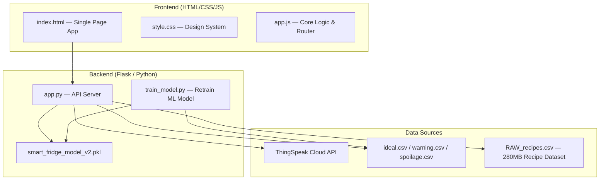

# Smart Fridge IoT Dashboard — Implementation Plan

## Overview

Build a full-stack, premium Smart Fridge monitoring dashboard with real-time ThingSpeak IoT integration, ML-based spoilage prediction, inventory management, and recipe recommendations. The app uses a **Flask (Python) backend** and a **vanilla HTML/CSS/JS frontend** with glassmorphic aesthetics.

## Architecture



---

## User Review Required

> [!IMPORTANT]
> **ThingSpeak Channel Configuration**: I need your ThingSpeak **Channel ID** and **Read API Key** to connect to your real device. I'll set up the app with placeholder values and a config panel in the UI so you can enter them at runtime. The app will gracefully fall back to default values (temp=12°C, humidity=50%, CO=5.6 ppm, door=closed) when ThingSpeak is unreachable.

> [!IMPORTANT]
> **Recipe Dataset Size**: The `RAW_recipes.csv` is ~280MB. Loading the full file at server startup would consume significant memory. I'll preprocess it into a smaller `recipes_processed.json` file (~5MB) at first launch, extracting only the columns needed (name, ingredients, steps, description).

> [!WARNING]
> **ML Model Compatibility**: The existing `smart_fridge_model.pkl` was trained with scikit-learn 1.6.1 but the current version is 1.8.0, causing unpickling errors. I'll retrain the model from the CSV data using a `train_model.py` script and save a new `smart_fridge_model_v2.pkl`.

---

## Proposed Changes

### Component 1: ML Model Retraining

#### [NEW] [train_model.py](file:///c:/Users/hp/OneDrive/Desktop/dev/aiotpro/train_model.py)
- Loads `ideal.csv`, `warning.csv`, `spoilage.csv` and labels them (0=ideal, 1=warning, 2=spoilage)
- Trains a `RandomForestClassifier` with probability support
- Saves as `smart_fridge_model_v2.pkl` (compatible with current sklearn 1.8.0)
- Prints training accuracy and classification report

---

### Component 2: Flask Backend API

#### [NEW] [app.py](file:///c:/Users/hp/OneDrive/Desktop/dev/aiotpro/app.py)

Flask server providing RESTful API endpoints:

| Endpoint | Method | Description |
|---|---|---|
| `/` | GET | Serves `index.html` |
| `/api/sensor-data` | GET | Fetches live data from ThingSpeak (with fallback defaults) |
| `/api/predict` | POST | ML prediction: takes `{temp, humidity, door, co}` → returns class + probabilities |
| `/api/predict-batch` | POST | Batch prediction for all inventory items |
| `/api/csv-insights` | GET | Returns aggregated stats from ideal/warning/spoilage CSVs for heatmap & pie charts |
| `/api/recipes` | GET | Returns processed recipe list (with optional `?ingredient=` filter) |
| `/api/config` | POST | Saves ThingSpeak channel ID and API key at runtime |

Key backend logic:
- **ThingSpeak proxy**: Fetches from `https://api.thingspeak.com/channels/{CHANNEL_ID}/feeds.json?api_key={API_KEY}&results=50` and maps field1→temp, field2→humidity, field3→door, field4→co
- **Fallback defaults**: temp=12, humidity=50, co=5.6, door=0 when ThingSpeak is unreachable
- **Recipe preprocessing**: On first launch, parses the 280MB CSV → extracts name, ingredients, steps, description → saves to `recipes_processed.json`
- **ML predictions**: Uses retrained model with `predict_proba()` for probability distribution

---

### Component 3: Frontend — Design System

#### [NEW] [static/style.css](file:///c:/Users/hp/OneDrive/Desktop/dev/aiotpro/static/style.css)

Premium glassmorphic design system with dual themes:

| Token | Light Mode | Dark Mode |
|---|---|---|
| `--bg-primary` | `#F6F6F6` | `#1A1A1D` |
| `--bg-secondary` | `#FFE2E2` | `#3B1C32` |
| `--accent` | `#8785A2` | `#A64D79` |
| `--accent-soft` | `#FFC7C7` | `#6A1E55` |
| `--status-safe` | `#2ecc71` | `#2ecc71` |
| `--status-warning` | `#f39c12` | `#f39c12` |
| `--status-danger` | `#e74c3c` | `#e74c3c` |

Features:
- CSS custom properties for theming
- Glassmorphism cards with `backdrop-filter: blur()`
- Smooth transitions, micro-animations, hover effects
- Responsive grid layout (sidebar + main content)
- Google Fonts (Inter)
- Animated status glows (green/yellow/red pulse)
- Custom scrollbar styling

---

### Component 4: Frontend — Application

#### [NEW] [templates/index.html](file:///c:/Users/hp/OneDrive/Desktop/dev/aiotpro/templates/index.html)

Single-page app with sidebar navigation and 4 main panels:

**Sidebar Navigation:**
- 🌡️ Sensor Status
- 📦 Inventory Management
- 🤖 AI/ML Predictions
- 🔔 Alerts & Notifications
- 🍳 Recipe Recommendations
- ⚙️ Settings (ThingSpeak config)

**Panel 1 — Sensor Status:**
- Real-time temperature, humidity, CO, door status gauges
- Animated circular progress indicators
- Live data from ThingSpeak (auto-refresh every 10s)
- Sparkline history charts (last 50 readings)
- Alert popup when spoilage thresholds are breached (temp>30 || humidity>70 || CO>15)

**Panel 2 — Inventory Management:**
- Add/remove items with name input
- Each item shows: name, time stored (live timer), condition badge (Ideal/Warning/Spoilt)
- Condition calculated from: storage time + current sensor readings + ML prediction
- Items glow green/yellow/red based on condition
- **Shopping List sub-panel**: Shows items going out of stock or nearing spoilage, plus recipe ingredient recommendations from CSV data
- LocalStorage persistence for inventory

**Panel 3 — AI/ML Predictions:**
- Takes inventory items and current sensor data
- Shows predicted days until spoilage per item
- Probability distribution (ideal% / warning% / spoilt%)
- Backup rule-based calculation when ML unavailable:
  - <1 day: 95% ideal, 5% warning
  - 1-4 days: 80% ideal, 15% warning, 5% spoilt
  - 3-7 days: 70% ideal, 20% warning, 10% spoilt
  - 7-10 days: 50% ideal, 35% warning, 15% spoilt
  - 10+ days: 30% ideal, 35% warning, 35% spoilt
- **Data Insights sub-panel**: Pie chart (ideal/warning/spoilage distribution), heatmap (temp vs humidity), built with Chart.js

**Panel 4 — Alerts & Notifications:**
- Auto-generated alerts: spoilage warnings, door left open, buy recommendations (every 3 hours), clean fridge (every 10 days)
- Alert history log with timestamps
- Dismissible alert cards
- LocalStorage persistence

**Panel 5 — Recipe Recommendations:**
- Filters recipes from CSV by matching ANY inventory ingredient
- Collapsed view: recipe name + matching ingredients badge
- Expanded view (on click): full recipe steps, description, time
- Below: full recipe catalog with search/filter
- Lazy loading for performance

#### [NEW] [static/app.js](file:///c:/Users/hp/OneDrive/Desktop/dev/aiotpro/static/app.js)

Core application logic:
- Panel router (show/hide panels via sidebar navigation)
- ThingSpeak data fetcher with 10s polling
- Inventory CRUD with localStorage
- Timer system for storage duration tracking
- ML prediction API calls + fallback rule engine
- Chart.js chart rendering (pie, heatmap, history sparklines)
- Alert generation engine
- Recipe filtering and rendering
- Theme toggle (light/dark)

---

## File Structure

```
aiotpro/
├── app.py                    # Flask backend
├── train_model.py            # ML model retrainer
├── smart_fridge_model_v2.pkl # Retrained model (generated)
├── recipes_processed.json    # Preprocessed recipes (generated on first run)
├── ideal.csv                 # Training data
├── warning.csv               # Training data
├── spoilage.csv              # Training data
├── RAW_recipes.csv           # Raw recipe dataset
├── templates/
│   └── index.html            # Main SPA
└── static/
    ├── style.css             # Design system
    └── app.js                # Application logic
```

---

## Open Questions

> [!IMPORTANT]
> 1. **ThingSpeak Field Mapping**: Do you have specific field mappings configured on your ThingSpeak channel? I'm assuming: field1=temperature, field2=humidity, field3=door_status (reed switch), field4=CO_gas. Please confirm or correct.
> 2. **ThingSpeak Channel ID & API Key**: Do you want to hardcode these or configure them at runtime via a settings panel? I'll include both options.

---

## Verification Plan

### Automated Tests
- Run `train_model.py` → verify model trains and saves successfully
- Run `app.py` → verify all API endpoints return correct JSON
- Browser test: navigate all 5 panels, verify UI renders correctly

### Manual Verification
- Test ThingSpeak integration with real channel ID
- Add/remove inventory items, verify persistence across refresh
- Verify spoilage alerts trigger correctly at thresholds
- Test light/dark mode toggle
- Test recipe search with various inventory combinations
