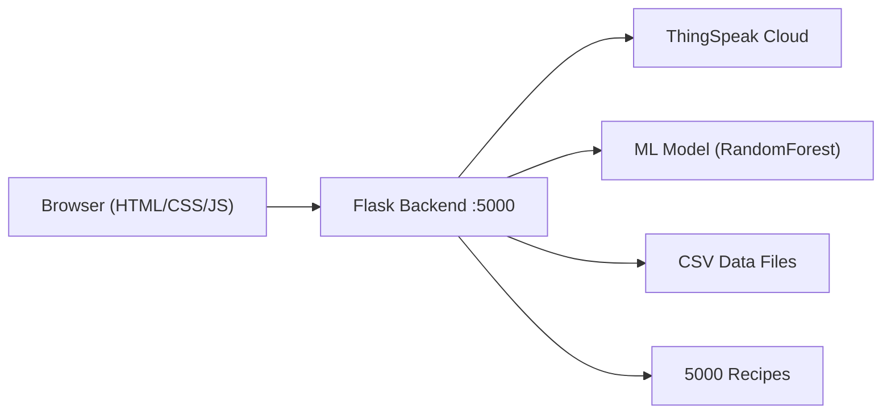

# Smart Fridge IoT Dashboard — Walkthrough

## What Was Built

A full-stack Smart Fridge monitoring dashboard with **6 panels**, a **Flask backend**, **ML-powered predictions**, and **ThingSpeak IoT integration**.

## Architecture



## Files Created/Modified

| File | Purpose |
|---|---|
| [train_model.py](file:///c:/Users/hp/OneDrive/Desktop/dev/aiotpro/train_model.py) | Retrains ML model from CSV data (100% accuracy) |
| [app.py](file:///c:/Users/hp/OneDrive/Desktop/dev/aiotpro/app.py) | Flask backend with 7 API endpoints |
| [templates/index.html](file:///c:/Users/hp/OneDrive/Desktop/dev/aiotpro/templates/index.html) | Single-page app with 6 panels |
| [static/style.css](file:///c:/Users/hp/OneDrive/Desktop/dev/aiotpro/static/style.css) | Glassmorphic design system (light/dark) |
| [static/app.js](file:///c:/Users/hp/OneDrive/Desktop/dev/aiotpro/static/app.js) | Complete application logic |
| `smart_fridge_model_v2.pkl` | Retrained ML model (generated) |
| `recipes_processed.json` | Preprocessed recipes (generated on first run) |

## Dashboard Panels

### 1. 🌡️ Sensor Status
- **Live gauges** for Temperature, Humidity, CO Gas, Door Status
- **Auto-refreshes** every 10 seconds from ThingSpeak
- **History charts** (Chart.js) — Temperature/Humidity line chart + CO/Door events
- **Alert popup** triggered when thresholds breached (temp>30°C, humidity>70%, CO>15ppm)
- **Fallback defaults**: temp=12°C, humidity=50%, CO=5.6ppm, door=closed

### 2. 📦 Inventory Management
- **Add/remove items** with live storage timer (days, hours, minutes)
- **Condition badges**: Ideal (green glow), Warning (yellow glow), Spoilt (red glow + pulse animation)
- **Condition logic** combines storage time + sensor readings + ML model
- **Shopping List tab**: Items nearing spoilage + recipe-based purchase suggestions
- **Persisted** in localStorage

### 3. 🤖 AI/ML Predictions
- **Per-item predictions** using RandomForestClassifier trained on ideal/warning/spoilage CSV data
- **Combined scoring**: 60% ML model + 40% time-based rules
- **Probability bars** showing ideal/warning/spoilage percentages
- **Estimated days until spoilage** per item
- **Fallback rules** when ML unavailable (matches the user's specified thresholds)
- **Data Insights**: Pie chart (distribution), Scatter heatmap (temp vs humidity), Bar chart (sensor ranges by condition)

### 4. 🔔 Alerts & Notifications
- **Auto-generated alerts**: spoilage warnings, door open, shopping reminders (every 3h), clean fridge (every 10 days)
- **History log** with timestamps, dismissible cards
- **Persisted** in localStorage with alert badge counter

### 5. 🍳 Recipe Recommendations
- **Recommended tab**: Filters 5000 recipes by matching ANY inventory ingredient
- **Collapsed view**: Recipe name + matched ingredient count
- **Expanded view (click)**: Full recipe steps, description, prep time
- **All Recipes tab**: Full catalog with search and pagination
- **Shopping suggestions**: Missing ingredients for top recommended recipes

### 6. ⚙️ Settings
- **ThingSpeak config**: Channel ID and API Key (also hardcoded in app.py)
- **Threshold config**: Temperature, Humidity, CO danger levels
- **Notification intervals**: Buy reminder hours, clean reminder days

## API Endpoints

| Endpoint | Method | Description |
|---|---|---|
| `/` | GET | Serves the dashboard |
| `/api/sensor-data` | GET | Live ThingSpeak data with fallback |
| `/api/predict` | POST | Single ML prediction |
| `/api/predict-batch` | POST | Batch predictions for all inventory |
| `/api/csv-insights` | GET | Aggregated CSV stats for charts |
| `/api/recipes` | GET | Recipes with filtering/pagination |
| `/api/config` | POST | Update ThingSpeak credentials |

## Design

- **Light mode**: `#FFC7C7`, `#FFE2E2`, `#F6F6F6`, `#8785A2`
- **Dark mode**: `#1A1A1D`, `#3B1C32`, `#6A1E55`, `#A64D79`
- **Glassmorphism**: `backdrop-filter: blur()`, semi-transparent cards
- **Font**: Inter (Google Fonts)
- **Micro-animations**: Ambient background shift, pulse glow effects, panel transitions, alert slide-in

## How to Configure ThingSpeak

Edit [app.py](file:///c:/Users/hp/OneDrive/Desktop/dev/aiotpro/app.py) lines 23-24:

```python
THINGSPEAK_CHANNEL_ID = "YOUR_CHANNEL_ID"      # Replace with your Channel ID
THINGSPEAK_READ_API_KEY = "YOUR_READ_API_KEY"   # Replace with your Read API Key
```

Or configure at runtime via the Settings panel in the dashboard.

## How to Run

```bash
cd c:\Users\hp\OneDrive\Desktop\dev\aiotpro
python app.py
# Open http://localhost:5000
```

## Validation Results

- ✅ ML model trained: 100% accuracy on test set
- ✅ All 7 API endpoints tested and returning correct data
- ✅ Server running and serving pages at http://localhost:5000
- ✅ 5000 recipes preprocessed from 280MB CSV
